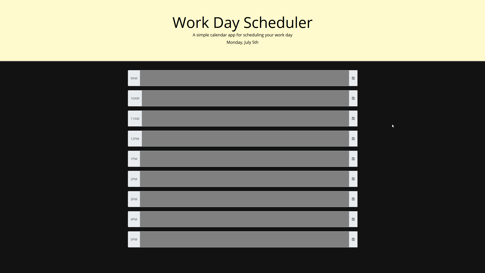

# 05 Third-Party APIs: Work Day Scheduler

As requested I have used the provided code and created a Quiz. If you look at the early commit you may see me change from hardcoding the HTML to then changing to JAVA script only to challenge myself a bit to finish, which is What I present to you.




[Hosted Website](https://ossaswossas.github.io/Work-Day-Scheduler/)


## Acceptance Criteria

```md
GIVEN I am using a daily planner to create a schedule
WHEN I open the planner
THEN the current day is displayed at the top of the calendar
WHEN I scroll down
THEN I am presented with timeblocks for standard business hours
WHEN I view the timeblocks for that day
THEN each timeblock is color coded to indicate whether it is in the past, present, or future
WHEN I click into a timeblock
THEN I can enter an event
WHEN I click the save button for that timeblock
THEN the text for that event is saved in local storage
WHEN I refresh the page
THEN the saved events persist
```

